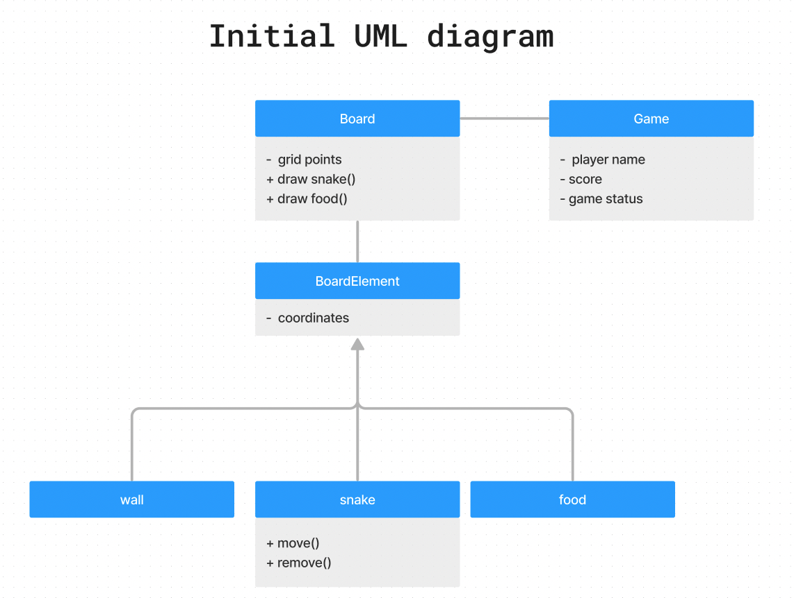
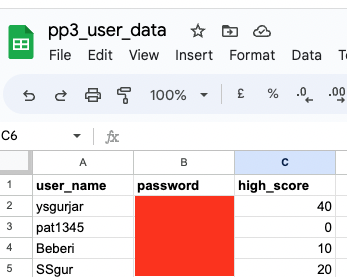

# **Snake Game**
Developed by Yash Gurjar

Am I reponsive Image

## Introduction
It is a classic snake game which needs no introduction. The objective of the snake is to eat the prey and get bigger without crashing into wall or itself. The bigger the snake, the higher the points are with additional difficulty level.

The game-app is hosted on Heroku and it is played on Command line emulator.

The user needs to sign up before playing game and he is able to store his high score as well.

## Contents
* [Project Goals](#project-goals)<br>
    * [For the user](#for-the-user)
    * [For the site owner](#for-the-site-owner)
* [User Experience](#user-experience)<br>
    * [Target audience](#target-audience)
    * [User requirements](#user-requirements)
    * [User Manual](#user-manual)
    * [User Stories](#user-stories)
* [Technical Design](#technical-design)
    * [Data Models](#data-models)
    * [Flowchart](#flowchart)
* [Features](#features)
    * [App Features](#app-features)
    * [Feature Ideas for future development](#feature-ideas-for-future-development)
* [Technologies Used](#technologies-used)
* [Deployment & Local Development](#deployment--local-development)
* [Testing](#testing)
    * [Validation](#validation)
    * [Manual Testing](#manual-testing)
    * [Automated Testing](#automated-testing)
    * [Bugs](#bugs)
* [Credits](#credits)

## Project Goals

### As a first time or recurring user, I want..
* To quickly guess what the game is about
* To to see rules and instructions
* To save my best game scores
* To create a new account
* To sign in existing account

### As a site onwer, I want..
* To Provide an easy to ready instructions and rules
* To make sure all errors are handled and communicated back to user
* Be able to see if my customer base is growing

## User Experience

### Target audience
Anyone looking for a bit of a fun and challenge is welcome to play.

### User requirements
* A game that is understandable and works as expected.
* Log-in works as expected and incorrect details do not allow the user access to their account.
* Game score is communicated clearly back to the user.

## Development

### Game logic

The high resolution image can be found [here](assets/pp3_game_logic.png).

## Initial UML


As a starting point, the following UML diagram was drawn. 


A board and board elements were identified as objects that can be modelled.

Board is a primary element, which defines the game area as a collection of grid points. During the game, snake and food will be drawn and redrawn on the board. Since drawing these elements will modify the state of the board, two associated methods i.e. draw_food and draw_snakes have been implemented with Board object. 

Additionally snake and food appears on certain grid points on the board. The same applies for boundries of the game as well, which is defined as wall. All three elements have grid points property in common. Hence a **supercalss** called BoardElement was constructed with wall, snake and food element **inheriting** from it. These structure will allow us to add additional properties and methods to subclass, should we need.

### Features implemented
Based on the requirements, the following features were implemented.

<details><summary>Welcome screen and rules</summary>


    
</details>


<details><summary>User input and validation screen</summary>


    
</details>

<details><summary>Game area with live score update</summary>


    
</details>
<details><summary>Game over with final score update</summary>


    
</details>

<details><summary>Google sheet to store user data</summary>


    
</details>

## Testing and Debugging

The following bugs were encountred and fixed during manual testing process.

<details><summary>Unable to draw the game on normal terminal window.</summary>

**Problem:** Normal Terminal does not allow positioning control precision. Also it is hard to refresh only certain part of it.

**Solution:** The [curses module](https://docs.python.org/3/howto/curses.html) came to rescue. The module is originally writen in C language and for Unix operating system. Important to note that the module does not come pre installed with Windows version of Python.

The functionality of creating a display was put in a seperate module named 'display_constructor.py'.

</details>

<details><summary>Terminal left in a "strange state" when exception was raised while playing the game.</summary>

**Problem:** The terminal won't return to normal state.


**Solution:** Use [wrapper function](https://docs.python.org/3/howto/curses.html) that will ensure that terminal is closed properly before raising an error.
```python
import wrapper from curses
 # Start game
    d.stdscr = d.curses.initscr()
    window = d.stdscr
    score = wrapper(run_game)
```

</details>

<details><summary>The snake will not respond to arrow keys properly.</summary>

**Problem:** Pressing up arrow key will move snake to left.

**Solution:** As indicated by this [blog post](https://www.quora.com/What-are-the-ASCII-values-for-the-arrow-keys-up-down-left-right), pressing an up arrow key produces three ASCII charcters. 27, 91, 65.

In my faulty code, the key were mapped to ascii charcters of WASD (wasd) for movements, which led to error. Asci value 65 is thrown in both cases of up arrow key and letter 'A'. 
```python
#Faulty code

    directions = {
        # 'w':119, 'W': 087 (Up)
        119: (-1, 0),
        87: (-1, 0),
        # 'a':97 , 'A': 65 (Left)
        97: (0, -1),
        65: (0, -1),
        # 'd':100 , 'D': 68 (Right)
        100: (0, 1),
        68: (0, 1),
        # 's' : 114 , 'S': 083 (Down)
        115: (1, 0),
        83: (1, 0)
```
This was re-mapped to respond to arrow keys.Arrow keys are regarded as special keys and an input from keyboard can be compared to constants available through curses module.
```python
#Correct code

   directions= {
        "KEY_UP": (-1,0),
        "KEY_DOWN": (1,0),
        "KEY_LEFT":(0,-1),
        "KEY_RIGHT":(0,1)
    }
    # example
    direction = directions.get("KEY_RIGHT")
```
</details>

<details><summary>The termial blinker will not disappear in the heroku deployed version</summary>

**Problem:** 

TRY 1:According to the [documentation for the module](https://docs.python.org/3/howto/curses.html) , `curs_set(False)` makes it invisible. It works in the gitpod terminal but doesn't  on Heroku deployed app.

TRY 2: Digging a little deeper, I [found](https://www.technovelty.org/linux/a-short-tour-of-term.html) that it depends on the capabilities of terminal being loaded. Th terminal deployed on gitpod is `xterm-256color` and terminal window on heroku app is` xterm-256`. Querying both for civis which presents the ascii code for hiding cursor I can confirm that the capabilities are not support in heroku terminal (the grep command returns nothing, means absence of support).

TRY 3: I have tried changing the terminal type in default.js file and rebuilding the project in heroku, but the terminal gives an error.

<details><summary>Screenshots of the trial and error encountered</summary>


</details>

WORKAROUND: Move the blinking cursor manually from 2nd last position the tail end of the snake and and disable `curses.set()` so, at the curser will not appear at strange locations on snake.

```python
#Correct code

window.noutrefresh()
d.curses.setsyx(*coordinates[-1])
d.curses.doupdate()
```

</details>

<details><summary>The user can sign up with a matching username in database - risk of duplicate username in db.</summary>

**Problem:** There are multiple combinatation of user's wish, input validation and password mis match that should not be allowed.

**Solution** Use `match` and `case` statement to cover all bases and give user an indication of what is wrong.

```python
match (is_user_in_db, is_pwd_match, selected_option):
        # Allow - new user is signing up with unique user name
        case (False, False, "2"):
            print("\nSign up successful. \n")
            append_gsheet_db(u_name, pwd, 0)
            return True

        # Allow - existing user is singing in with matching pwd
        case (True, True, "1"):
            print("\nSing in successful. \n")
            return True

        # Prevent - new user singing up with
        # existing user name and existing pwd
        case (True, True, "2"):
            print(" \nUsername already exists. \n")
            print("Please select sign up if you are existing user. \n")
            print(
                "Please select a different user name if you are a new user. \n"
            )
            return False

        # Prevent - new user singing up with existing user name and new pwd
        case (True, False, "2"):
            print("\nUsername already exists. \n")
            print(
                "If you are a new user, retry by choosing another username. \n"
            )
            print(
                "If you are an existing user and forgot your pwd,"
                "please create a new login.\n"
            )
            return False

        # Prevent - sign in with wrong password
        case (True, False, "1"):
            print("\nUsername already exists. \n")
            print("Wrong password \n")
            print(
                "If you are an existing user and forgot your pwd"
                "please create a new login. \n"
            )
            return False
```

</details>

<details><summary>The game will terminate and loop back without any proper feedback to user.</summary>

**Solution**: Add `time.sleep()` and display final high score before redirecting user to main screen

```python
# Game over text
intro.game_over_text(score, a.get_high_score(user_name))
print("Redirecting to main screen.. Please wait..")
time.sleep(10)
```
</details>

<details><summary>The high score from previous game was visible as a starting score for next game - ghost value problem.</summary>

**Solution**: This was due to not clearing the screen at location where high score is displayed. A small code was added to perform so.

```python
# Erase high score
d.clear_screen({(22,1),(22,2),(22,3),(22,4),(22,5),(22,6),(22,7),(22,8),(22,9),(22,10)})

```
</details>

<details><summary>The snake is able to take 180 degree turn, crash with itself and lead to game over.</summary>

**Problem**: For example, when left arrow key is pressed when snake is moving right. Snake will draw on itself and game will be over (because it is considered as snake crashing with itself)

**Solution**: Add a block of code to prevent this behaviour.
```python
try:
    capture_key = window.getkey()
except:
    capture_key = None

# prevent snake from moving 180 degrees.
# It can only move 90 degrees
match (direction, capture_key):
    case ((-1, 0), "KEY_DOWN"):
        pass
    case ((1, 0), "KEY_UP"):
        pass
    case ((0, -1), "KEY_RIGHT"):
        pass
    case ((0, 1), "KEY_LEFT"):
        pass
    case _:
        direction = directions.get(capture_key, direction)

snake.move_snake(direction)
```
</details>

<details><summary>During deployment, the credential file was not found.</summary>

**Solution:**Add config variable with credentials


</details>

<details><summary>PEP8 Python Linter Errors.</summary>

**Problem** : All the erros were cleared
</details>

```python

```
